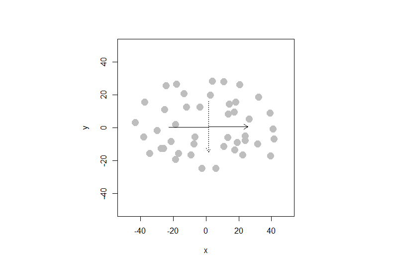
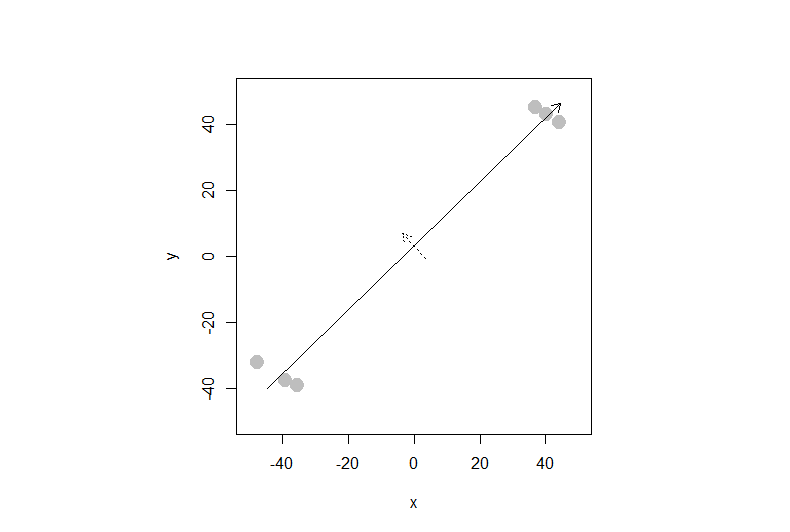

```{r setup, include=FALSE}
knitr::opts_chunk$set(echo = TRUE)
knitr::opts_chunk$set(warning = FALSE) 

```

### Question 1)  Let’s revisit the issue of multicollinearity of main effects (between cylinders, displacement, horsepower, and weight) we saw in the cars dataset, and try to apply principal components to it. Start by recreating the cars_log dataset, which log-transforms all variables except model year and origin. Important: remove any rows that have missing values.


```{r}
cars <- read.table("auto-data.txt", header=FALSE, na.strings = "?")
names(cars) <- c("mpg", "cylinders", "displacement", "horsepower", "weight", 
                 "acceleration", "model_year", "origin", "car_name")

cars_log <- with(cars, data.frame(log(mpg), log(cylinders), log(displacement),
log(horsepower),log(weight),log(acceleration),model_year, origin))

cars_log <- na.omit(cars_log)


```

### a) Let’s analyze the principal components of the four collinear variables


        i) Create a new data.frame of the four log-transformed variables with high multicollinearity
        
```{r}
mc <- subset(cars_log, select=c("log.weight." , "log.cylinders.", "log.displacement." , "log.horsepower."))

```


        ii) How much variance of the four variables is explained by their first principal component?


```{r}
mc_eigen <- eigen(cor(mc))
mc_eigen$values[1]/sum(mc_eigen$values)
```
variance of the four variables is explained by their first principal component is 0.9185647. 


        iii)Looking at the values and valence (positiveness/negativeness) of the first principal component’s eigenvector,
        what would you call the information captured by this component?
```{r}
mc_eigen$vectors


```
We see pc1 equally captures cylinders, displacement, horsepower, and weight, and pc2 captures mostly horsepower, pc3 mostly caputure weight, pc4 captures displacement.


### b) Let’s revisit our regression analysis on cars_log


        i)Store the scores of the first principal component as a new column of cars_log
        Give this new column a name suitable for what it captures (see 1.a.i.)

```{r}
cars_log$pc_score <- prcomp(mc)$x
```
        
        
        ii) Regress mpg over the column with PC1 scores (replacing cylinders, displacement, horsepower, and weight), as well as acceleration, model_year and origin


```{r}
md<-lm( log.mpg.~ pc_score[,"PC1"] +log.acceleration. +model_year+factor(origin), data=cars_log)
summary(md)
```

        iii) Try running the regression again over the same independent variables, but this time with everything standardized. How important is this new column relative to other columns?

```{r}
temp <- as.data.frame(cbind(scale(cars_log[,c(-8)]),origin = cars_log[,8]))
md2<-lm( log.mpg.~ pc_score.PC1 +log.acceleration. +model_year+factor(origin), data=temp)
summary(md2)
```
pc_score.PC1 is very important in this model, since it's estimated beta value is 0.832369, is relatively much higher than other variables, so it has a bigger influence on log.mpg.  

### Question 2)

```{r}

sq <- read.csv("security_questions.csv")
```

### a) How much variance did each extracted factor explain?

```{r}
summary(prcomp(sq, scale. = TRUE))

```

The proportion of Variance each extracted factor explain are (0.5173 0.08869 0.06386 0.04233 0.03751 0.03398 0.02794 0.02602 0.02511 0.0214 0.01972 0.01674 0.01624 0.01456 0.01303 0.0128 0.0116 0.0112)


### b) How many dimensions would you retain, according to the two criteria we discussed?

```{r}

eigen(cor(sq))$values
```

```{r}
screeplot(prcomp(sq, scale. = TRUE), type="lines")
abline(h = 1, col = "red")

```

I would retain 3 dimensions.

### c) (ungraded) Can you interpret what any of the principal components mean? Try guessing the meaning of the first two or three PCs looking at the PC-vs-variable matrix


### Question 3) Let’s simulate how principal components behave interactively: run the interactive_pca() function from the compstatslib package we have used earlier:

```{r}
library(compstatslib)
```

### a) Create an oval shaped scatter plot of points that stretches in two directions – you should find that the principal component vectors point in the major and minor directions of variance (dispersion). Show this visualization.

```{r, echo=FALSE, out.width = '100%'}


```

### b) Can you create a scatterplot whose principal component vectors do NOT seem to match the major directions of variance? Show this visualization.

```{r, echo=FALSE, out.width = '100%'}


```
