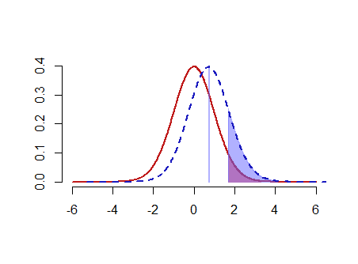
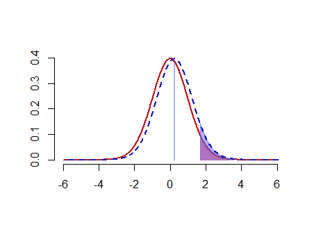
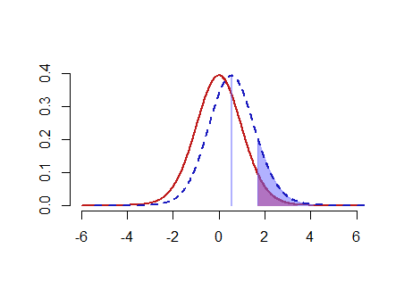
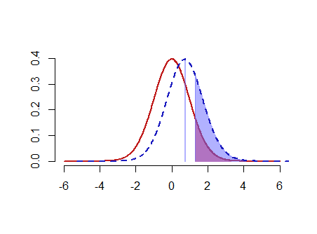

```{r setup, include=FALSE}
knitr::opts_chunk$set(echo = TRUE)
```

### Question 1) The following problem's data is real but the scenario is strictly imaginary

### The large American phone company Verizon had a monopoly on phone services in many areas of the US. The New York Public Utilities Commission (PUC) regularly monitors repair times with customers in New York to verify the quality of Verizon's services. The file verizon.csv has a recent sample of repair times collected by the PUC.

```{r}
verzion <- read.csv("verizon.csv")

sample_size <- length(verzion$Time) 
sample_mean <- mean(verzion$Time)
sample_sd <- sd(verzion$Time)
se <- (sample_sd /sqrt(sample_size))

```

ILEC is Incumbent Local Exchange Carrier CLEC is Competitive Local Exchange Carrier

### a) Imagine that Verizon claims that they take 7.6 minutes to repair phone services for its customers on average. The PUC seeks to verify this claim at 99% confidence (i.e., significance $\alpha$ = 1%)

### using traditional statistical methods.

### i) Visualize the distribution of Verizon's repair times, marking the mean with a vertical line

```{r}
# Let’s plot the density function of Verizon's repair times
plot(density(verzion$Time), col="blue", lwd=2, 
     main = "Verizon's repair times")

# Add vertical lines showing mean
abline(v=mean(verzion$Time))

```

### ii) Given what the PUC wishes to test, how would you write the hypothesis? (not graded)

$H_0$ : The average minutes for Verizon to repair phone services for its customers is 7.6 minutes.
$H_1$ : The average minutes for Verizon to repair phone services for its customers is not 7.6 minutes.

### iii) Estimate the population mean, and the 99% confidence interval (CI) of this estimate.

```{r}
#99% CI
c(sample_mean-2.58*se,sample_mean+2.58*se)
```

The population mean is `r sample_mean`, and the 99% CI is `r c(sample_mean-2.58*se,sample_mean+2.58*se)`.

### iv) Find the t-statistic and p-value of the test

```{r}

t <- (sample_mean - 7.6) / se

df <- sample_size - 1
p <- 1 - pt(t, df)

```

The value of t-statistic is `r t`, p-value is `r p`.

### v) Briefly describe how these values relate to the Null distribution of t (not graded)

When df increase, the shape of t distribution becomes more similar to a normal distribution. Theoretically, the t-distribution only becomes perfectly normal when the sample size reaches the population size.

### vi) What is your conclusion about the company's claim from this t-statistic, and why?

Because this is a two sided test, the thresh hold for single side is 0.05%. The p-value `r p` is bigger than 0.5%, so we can not reject $H_0$ at 99% confidence.

Also we can do t test for checking.

```{r}
t.test(verzion$Time,mu=7.6,alternative="two.sided",conf.level = 0.99) 
```
The overall p-value = 0.01053 > 0.01, so we can not reject $H_0$ at 99% confidence.

### b) Let's re-examine Verizon's claim that they take no more than 7.6 minutes on average, but this time using bootstrapped testing:

### i) Bootstrapped Percentile: Estimate the bootstrapped 99% CI of the population mean

```{r}
set.seed(12)

compute_sample_mean <- function(sample0) {
  resample <- sample(sample0, length(sample0), replace=TRUE)
  mean(resample)
}
bootmean <- replicate(2000,compute_sample_mean(verzion$Time))
mean(bootmean)
quantile(bootmean, probs=c(0.005, 0.995))

```

The bootstrapped mean is `r mean(bootmean)`, and the 99% CI is `r quantile(bootmean, probs=c(0.005, 0.995))`.


### ii) Bootstrapped Difference of Means: What is the 99% CI of the bootstrapped difference between the sample mean and the hypothesized mean?

```{r}
set.seed(12)

bootmeandiff <- replicate(2000,compute_sample_mean(verzion$Time-7.6))
mean(bootmeandiff)
quantile(bootmeandiff, probs=c(0.005, 0.995))

```

The bootstrapped mean is `r mean(bootmeandiff)`, and the 99% CI is `r quantile(bootmeandiff, probs=c(0.005, 0.995))`.


### iii) Plot distribution the two bootstraps above

```{r}
plot(density(bootmean),main = "bootstrapped mean")
abline(v=quantile(bootmean, probs=c(0.005, 0.995)), lty="dashed")
```

```{r}
plot(density(bootmeandiff),main = "Bootstrapped Difference of Means")
abline(v=quantile(bootmeandiff, probs=c(0.005, 0.995)), lty="dashed")
```

### iv) Does the bootstrapped approach agree with the traditional t-test in part [a]?

Yes, since traditional t-test does not reject $H_0$ at 99% confidence, and in (b) the bootstrapped approach we find 7.6 and 0 are both inside each 99% CI, so in (b) both result does not reject $H_0$ at 99% confidence.

However, since this is a bootstrapped approach, and this problem is on a critical point when we choose 99% confidence, so while doing bootstrapped approach, we might get some result that doesn't agree with the traditional t-test in part [a]. This is a counter example simply change the random seed:

```{r}
set.seed(123)
bootmean <- replicate(2000,compute_sample_mean(verzion$Time))
quantile(bootmean, probs=c(0.005, 0.995))


bootmeandiff <- replicate(2000,compute_sample_mean(verzion$Time-7.6))
quantile(bootmeandiff, probs=c(0.005, 0.995))

```
Where 7.6 and 0 are both outside of the 99% CI.


### c) Finally, imagine that Verizon notes that the distribution of repair times is highly skewed by outliers, and feel that testing the mean in not fair because the mean is sensitive to outliers. They claim that the median is a more fair test, and claim that the median repair time is no more than 3.5 minutes at 99% confidence (i.e., significance $\alpha$ = 1%).

### i) Bootstrapped Percentile: Estimate the bootstrapped 99% CI of the population median

```{r}
set.seed(12)
compute_sample_median <- function(sample0) {
  resample <- sample(sample0, length(sample0), replace=TRUE)
  median(resample)
}
bootmedian <- replicate(2000,compute_sample_median(verzion$Time))
mean(bootmedian)
quantile(bootmedian, probs=c(0.005, 0.995))

```

### ii) Bootstrapped Difference of Medians: What is the 99% CI of the bootstrapped difference between the sample median and the hypothesized median?

```{r}
set.seed(12)
bootmediandiff <- replicate(2000,compute_sample_median(verzion$Time-3.5))
mean(bootmediandiff)
quantile(bootmediandiff, probs=c(0.005, 0.995))

```

### iii) Plot distribution the two bootstraps above

```{r}
plot(density(bootmedian),main = "bootstrapped median")
abline(v=quantile(bootmedian, probs=c(0.005, 0.995)), lty="dashed")
```

```{r}
plot(density(bootmediandiff),main = "Bootstrapped Difference of median")
abline(v=quantile(bootmediandiff, probs=c(0.005, 0.995)), lty="dashed")
```

### iv) What is your conclusion about Verizon's claim about the median, and why?
We does not reject $H_0$ at 99% confidence, so agree with Verizon's claim about the median equals 3.5 .


### Question 2) Load the compstatslib package and run interactive_t\_test(). You will see a simulation of null and alternative distributions of the t-statistic, along with significance and power. If you do not see interactive controls (slider bars), press the gears icon (*) on the top-left of the visualization.

```{r}
library(compstatslib)

```

### Use the slider bars of the simulation to the values your colleague found and confirm from the visualization that we cannot reject the null hypothesis. Consider the scenarios (a -- d) independently using the simulation tool. For each scenario, start with the initial parameters above, then adjust them to answer the following questions:

```{r, echo=FALSE, out.width = '100%'}


```

##### i) Would this scenario create systematic or random error (or both or neither)?

##### ii) Which part of the t-statistic or significance (diff, sd, n, alpha) would be affected?

##### iii) Will it increase or decrease our power to reject the null hypothesis?

##### iv) Which kind of error (Type I or Type II) becomes more likely because of this scenario?

### a) You discover that your colleague wanted to target the general population of Taiwanese users of the product. However, he only collected data from a pool of young consumers, and missed many older customers who you suspect might use the product much less every day.

i) systematic error

ii) Since we are missing older customer's data, if we sample again including older customers, we expect **diff will decrease** since older customers might use the product much less every day, and **sd will increase**.

iii) It will **decrease our power** to reject the null hypothesis.

```{r, echo=FALSE, out.width = '100%'}


```

iv) Power is 1 - $\beta$, power decrease implies $\beta$, which is the probability of a Type II error, will increase. Type I error remains the same.

### b) You find that 20 of the respondents are reporting data from the wrong wearable device, so they should be removed from the data. These 20 people are just like the others in every other respect.

i) random error

ii) After removing 20 people, there are only 30 people left, so **n decrease**.

iii) It will **decrease our power** to reject the null hypothesis.

```{r, echo=FALSE, out.width = '100%'}


```

iv) Power is 1 - $\beta$, power decrease implies $\beta$, which is the probability of a Type II error, will increase. Type I error remains the same.


### c) A very annoying professor visiting your company has criticized your colleague's "95% confidence" criteria, and has suggested relaxing it to just 90%.

i) neither

ii) Since $\alpha$ change from 5% to 10%, **$\alpha$ increase**.

iii) It will **increase our power** to reject the null hypothesis.

```{r, echo=FALSE, out.width = '100%'}


```

iv) Since $\alpha$ is the probability of a Type I error, $\alpha$ increase, Type I error will increase. Also when power increase, Type II error will decrease.


### d) Your colleague has measured usage times on five weekdays and taken a daily average. But you feel this will underreport usage for younger people who are very active on weekends, whereas it over-reports usage of older users.

i) both

ii) We don't have enough information to guess how diff and sd is going to increase or decrease. n and $\alpha$ remains the same.

iii) It depends on the result of the change of diff.

iv) Type I error stays the same, Type II error might either increase or decrease depends on the result of the change of diff.
