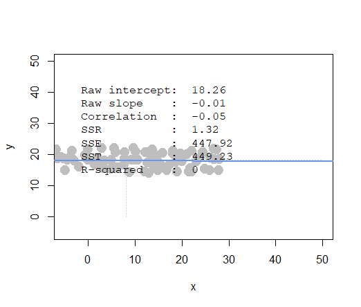
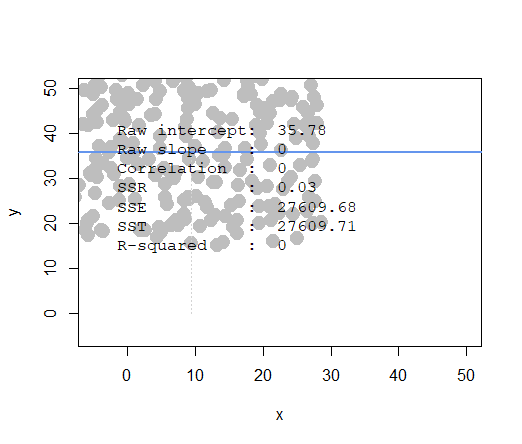
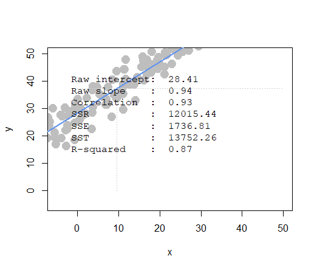
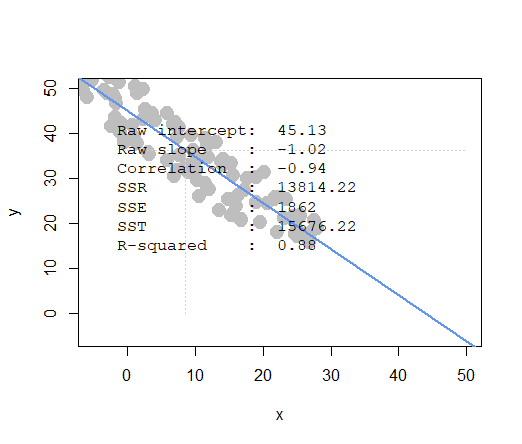
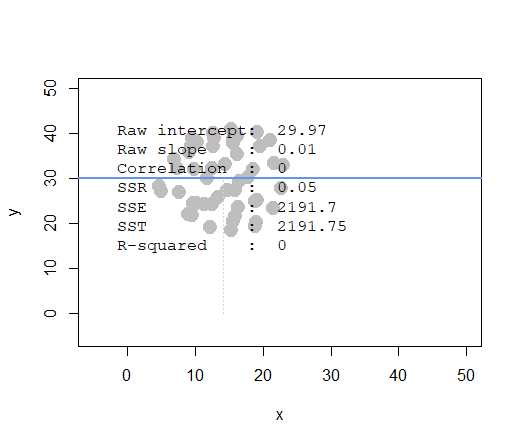
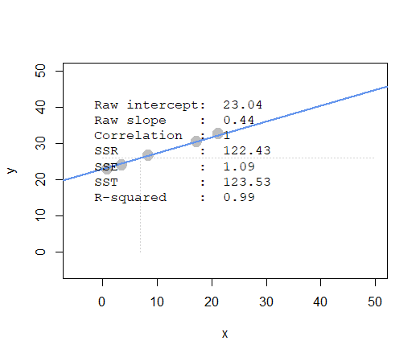
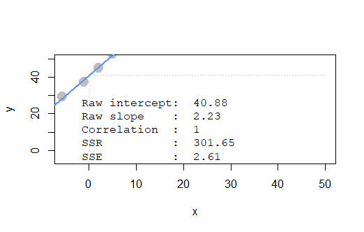
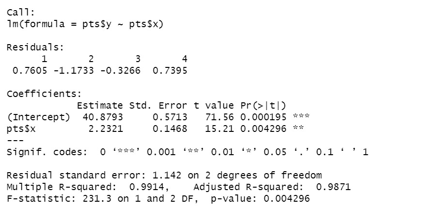

```{r setup, include=FALSE}
knitr::opts_chunk$set(echo = TRUE)
knitr::opts_chunk$set(warning = FALSE) 

```

### Question 1) Let’s explore and describe the data and develop some early intuitive thoughts:


```{r}

library(data.table)
ac_bundles_dt <- fread("piccollage_accounts_bundles.csv")
ac_bundles_matrix <- as.matrix(ac_bundles_dt[, -1, with=FALSE])
```

### a)Let’s explore to see if any sticker bundles seem intuitively similar:

        i) (recommended) Download PicCollage onto your mobile from the App Store and take a look at the style and content of various bundles in their Sticker Store (iOS app: can see how many recommendations does each bundle have? Android app might not have recommendations)
        
        
```{r, echo=FALSE, out.width = '100%'}


```

        ii) Find a single sticker bundle that is both in our limited data set and also in the app’s Sticker Store (e.g., “sweetmothersday”). Then, use your intuition to recommend (guess!) five other bundles in our dataset that might have similar usage patterns as this bundle.
        
        
```{r}
colnames(ac_bundles_dt)

```
Choose **xoxo** as example.

```{r, echo=FALSE, out.width = '100%'}


```

Guess: 
1.CutieV
2.valentineStickers
3.HeartStickerPack
4.supersweet
5.cutevalentine
may also have similar usage patterns as this bundle.


### b) Let’s find similar bundles using geometric models of similarity:

        i) Let’s create cosine similarity based recommendations for all bundles:

                1. )Create a matrix or data.frame of the top 5 recommendations for all bundles

                2. )Create a new function that automates the above functionality: it should take an accounts-bundles matrix as a parameter, and return a data object with the top 5 recommendations for each bundle in our data set, using cosine similarity.

```{r}

#install.packages("lsa")
library(lsa)

sort_data <- function(x){
  top6=x[order(x, decreasing=T)[2:6]]
  attributes(top6)$names
}
### function contribution to 詹涵雰


recommendations=t(apply(cosine(ac_bundles_matrix), 1, sort_data))
head(recommendations)
```

                3. )What are the top 5 recommendations for the bundle you chose to explore earlier?
                
```{r}
recommendations["xoxo",]
```
The top 5 recommendations for the bundle is:

1."BlingStickerPack"
2."OddAnatomy"
3."between"
4."gwen"
5."KLL"


        ii) Let’s create correlation based recommendations.
        
                1. )Reuse the function you created above (don’t change it; don’t use the cor() function)

                2. )But this time give the function an accounts-bundles matrix where each bundle (column) has already been mean-centered in advance.

```{r}


sort_data <- function(x){
  top6=x[order(x, decreasing=T)[2:6]]
  attributes(top6)$names
}
### function contribution to 詹涵雰


recommendations=t(apply(cosine(scale(ac_bundles_matrix, scale = FALSE)), 1, sort_data))
head(recommendations)
```

                3. )Now what are the top 5 recommendations for the bundle you chose to explore earlier?
                
                
```{r}
recommendations["xoxo",]
```
The top 5 recommendations for the bundle is:

1."BlingStickerPack"
2."OddAnatomy"
3."between"
4."gwen"
5."KLL"


        iii) Let’s create adjusted-cosine based recommendations.

                1. )Reuse the function you created above (you should not have to change it) 
                
                2. )But this time give the function an accounts-bundles matrix where each account (row) has already been mean-centered in advance.

```{r}


sort_data <- function(x){
  top6=x[order(x, decreasing=T)[2:6]]
  attributes(top6)$names
}
### function contribution to 詹涵雰


recommendations=t(apply(cosine(ac_bundles_matrix-rowMeans(ac_bundles_matrix)), 1, sort_data))
head(recommendations)
```

                3. )What are the top 5 recommendations for the bundle you chose to explore earlier?
          
          
                
```{r}
recommendations["xoxo",]
```
The top 5 recommendations for the bundle is:

1."BlingStickerPack"
2."between"
3."OddAnatomy"
4."gwen"
5."Monsterhigh"


        iii) (not graded) Are the three sets of geometric recommendations similar in nature (theme/keywords) to the recommendations you picked earlier using your intuition alone? What reasons might explain why your computational geometric recommendation models produce different results from your intuition?
        
No, I thought xoxo will be related with love or valentines, I really don't know the reason to explain the different recommendation.
        
        iv) (not graded) What do you think is the conceptual difference in cosine similarity, correlation, and adjusted-cosine?
        
https://www.researchgate.net/post/Can_someone_differentiate_between_Cosine_Adjusted_cosine_and_Pearson_correlation_similarity_measuring_techniques

Mr. Alexander Egoyan gives a clean explanation about it.

### Question 2) Correlation is at the heart of many data analytic methods so let’s explore it further.


```{r}
library(compstatslib)
```


### a) Scenario A: Create a horizontal set of random points, with a relatively narrow but flat distribution.

```{r, echo=FALSE, out.width = '100%'}


```

        i) What raw slope of x and y would you generally expect?
        
        A: 0
        
        ii) What is the correlation of x and y that you would generally expect?
        
        A: 0


### b) Scenario B: Create a random set of points to fill the entire plotting area, along both x-axis and y-axis

```{r, echo=FALSE, out.width = '100%'}


```

        i) What raw slope of x and y would you generally expect?
        
        A: 0
        
        ii) What is the correlation of x and y that you would generally expect?
        
        A: 0


### c) Scenario C: Create a diagonal set of random points trending upwards at 45 degrees


```{r, echo=FALSE, out.width = '100%'}


```

        i) What raw slope of x and y would you generally expect?
        
        A: 1
        
        ii) What is the correlation of x and y that you would generally expect?
        
        A: 1

### d) Scenario D: Create a diagonal set of random trending downwards at 45 degrees

```{r, echo=FALSE, out.width = '100%'}


```

        i) What raw slope of x and y would you generally expect?
        
        A: -1
        
        ii) What is the correlation of x and y that you would generally expect?
        
        A: -1
        
### e) Apart from any of the above scenarios, find another pattern of data points with no correlation (r ≈ 0).

This is a pattern of a circle.

```{r, echo=FALSE, out.width = '100%'}


```


### f) Apart from any of the above scenarios, find another pattern of data points with perfect correlation (r ≈ 1).

This is a pattern of a straight line.

```{r, echo=FALSE, out.width = '100%'}


```


### g) Let’s see how correlation relates to simple regression, by simulating any linear relationship you wish:

```{r, echo=FALSE, out.width = '100%'}


```

        i) Run the simulation and record the points you create: pts <- interactive_regression() (simulate either a positive or negative relationship)
        
```{r eval=FALSE, include=FALSE}
pts <- interactive_regression()
```

```{r, echo=FALSE, out.width = '100%'}


```


        ii) Use the lm() function to estimate the regression intercept and slope of pts to ensure they are the same as the values reported in the simulation plot: summary( lm( pts$y ~ pts$x ))
        
```{r eval=FALSE, include=FALSE}
summary( lm( pts$y ~ pts$x ))

```


```{r, echo=FALSE, out.width = '100%'}


```

        iii) Estimate the correlation of x and y to see it is the same as reported in the plot: cor(pts)
        
```{r eval=FALSE, include=FALSE}

cor(pts)
```

         x        y
x 1.000000 0.995704
y 0.995704 1.000000


The result is close to 1, which is same as reported in the plot.
        
        iv) Now, standardize the values of both x and y from pts and re-estimate the regression slope
        
```{r eval=FALSE, include=FALSE}
pts_scale <- scale(pts)

summary( lm( pts_scale[,2] ~ pts_scale[,1] ))

```


```{r, echo=FALSE, out.width = '100%'}


```
        
        v)What is the relationship between correlation and the standardized simple-regression estimates?
        
The standardlized estimates value for x equals to the correlation.