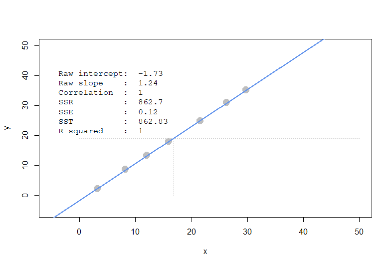
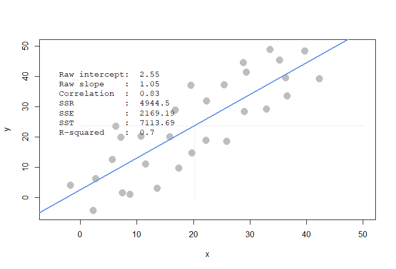
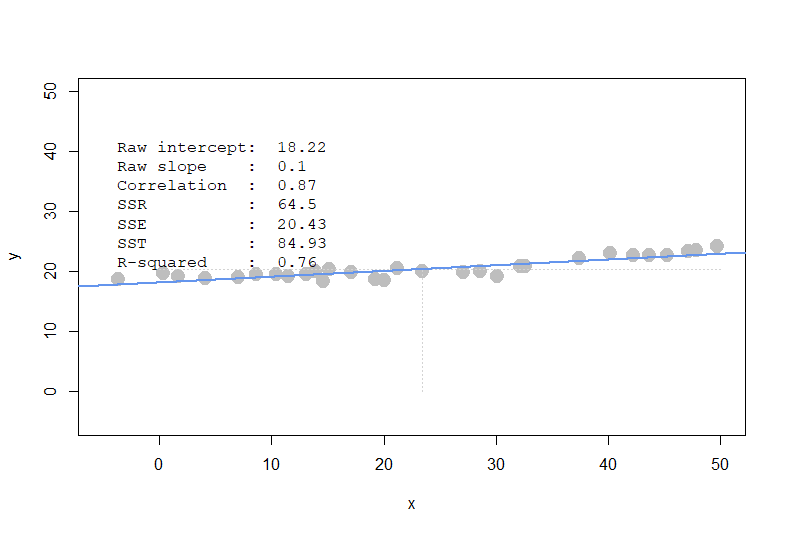
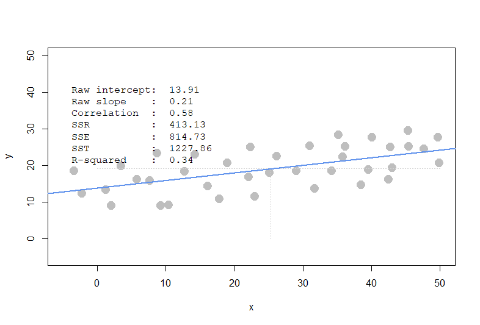

```{r setup, include=FALSE}
knitr::opts_chunk$set(echo = TRUE)
knitr::opts_chunk$set(warning = FALSE) 

```

### Question 1) 

```{r}
library(compstatslib)
```

```{r, echo=FALSE, out.width = '25%'}





```


### a)Comparing scenarios 1 and 2, which do we expect to have a stronger $R^{2}$ ?

scenarios 1

### b)Comparing scenarios 3 and 4, which do we expect to have a stronger $R^{2}$ ?

scenarios 3

### c)Comparing scenarios 1 and 2, which do we expect has bigger/smaller SSE, SSR, and SST? (intuitively)

SSE: scenarios 1 smaller, scenarios 2 bigger.

SSR: scenarios 1 smaller, scenarios 2 bigger.

SST: scenarios 1 smaller, scenarios 2 bigger.

### d)Comparing scenarios 3 and 4, which do we expect has bigger/smaller SSE, SSR, and SST? (intuitively)

SSE: scenarios 3 smaller, scenarios 4 bigger.

SSR: scenarios 3 smaller, scenarios 4 bigger.

SST: scenarios 3 smaller, scenarios 4 bigger.


### Q2)Let’s analzye the programmer_salaries.txt dataset we saw in class. Read the file using read.csv("programmer_salaries.txt", sep="\t") because the columns are separated by tabs (\t).

```{r}
q2 <- read.csv("programmer_salaries.txt", sep="\t")

```

### a) Use the lm() function to estimate the regression model Salary ~ Experience + Score + Degree. Show the beta coefficients, R2, and the first 5 values of y  ($fitted.values) and  ($residuals)

```{r}
md1 <- lm(Salary ~ Experience + Score + Degree, data = q2)
summary(md1)
```
$R^{2}$ : 0.8468


First 5 values of $\hat{y}$  : 

```{r}

head(md1$fitted.values,5)
```

First 5 values of $\epsilon$  : 

```{r}

head(md1$residuals,5)
```


### b) Use only linear algebra and the geometric view of regression to estimate the regression yourself

        i) Create an X matrix that has a first column of 1s followed by columns of the independent variables
        (only show the code)

```{r}
x <-data.matrix( cbind(rep(1, length(q2)),q2[,-4]))
colnames(x)[1] <- "Intercept"
```


        ii) Create a y vector with the Salary values (only show the code)
        
```{r}
y <- q2[,4]
```

        iii) Compute the beta_hat vector of estimated regression coefficients (show the code and values)
```{r}
beta_hat <- solve(t(x)%*%x)%*%t(x)%*%y
beta_hat

```
        
        iv) Compute a y_hat vector of estimated y values, and a res vector of residuals 
        (show the code and the first 5 values of y_hat and res)

```{r}
y_hat <- x%*%beta_hat
head(y_hat,5)
```

        v) Using only the results from (i) – (iv), compute SSR, SSE and SST (show the code and values)
        
        
```{r}

SSE <- sum((y-y_hat)^2)
SST <- SSE / (1 - cor(y,y_hat)^2)
SSR <- cor(y,y_hat)^2 * SST


```

        
### c) Compute R2 for in two ways, and confirm you get the same results (show code and values):

        i) Use any combination of SSR, SSE, and SST
```{r}
SSR/SST

```
        
        ii) Use the squared correlation of vectors y and y hat
        
```{r}
cor(y,y_hat)^2
```


### Q3

```{r}
auto <- read.table("auto-data.txt", header=FALSE, na.strings = "?")
names(auto) <- c("mpg", "cylinders", "displacement", "horsepower", "weight", 
                 "acceleration", "model_year", "origin", "car_name")

```

### a) Let’s first try exploring this data and problem:


        i) Visualize the data as you wish (report only relevant/interesting plots)

```{r, out.width="50%"}
par(mfrow=c(2,2))

library(GGally)
for (i in seq(1:8)) {
  hist(auto[,i],xlab=(colnames(auto)[i]))
}

par(mfrow=c(1,1))

```


        ii) Report a correlation table of all variables, rounding to two decimal places
        (in the cor() function, set use="pairwise.complete.obs" to handle missing values)

        
```{r}
round(cor(auto[,-9],use="pairwise.complete.obs"),2)
  
  
```

        iii) From the visualizations and correlations, which variables appear to relate to mpg?

```{r}
ggpairs (auto[,-9])

```
        
From the correlation and the plotting result of ggpairs, ggapirs did cor.test during the plotting, and the testing result of mpg with other variables are all significant, so I will say cylinders, displacement, horsepower, weight, acceleration, model_year, origin are all appear to relate to mpg.

        iv) Which relationships might not be linear? (don’t worry about linearity for rest of this HW)


For closer look to find non linear relationships, draw scatter plot against two variables.

```{r, out.width="100%"}
par(mfrow=c(2,2))

for (i in seq(1:8)) {
  for (j in seq(1:8)) {
    if(i == j) next
    if(i>j) next
    plot(auto[,i],auto[,j],xlab = (colnames(auto)[i]),ylab = (colnames(auto)[j]), pch=19)
  }
}
par(mfrow=c(1,1))

```

From plot "mpg and displacement", "mpg and horsepower", "mpg and weight", "mpg and acceleration", there may be quadratic relation.

From plot "displacement and origin", "horsepower and origin", "weight and origin" there may be quadratic relation.

From plot "horsepower and weight", "horsepower and acceleration", there may be quadratic relation.

        v) Are there any pairs of independent variables that are highly correlated (r > 0.7)?

```{r}
round(cor(auto[,-9],use="pairwise.complete.obs"),2)>0.7
  
  
```
Yes, there are many pairs of independent variables that can beconsider as highly correlated.
"cylinders and displacement", "cylinders and horsepower", "cylinders and weight"
"displacement and horsepower", "displacement and weight"
"horsepower and weight"

### b) Let’s create a linear regression model where mpg is dependent upon all other suitable variables (Note: origin is categorical with three levels, so use factor(origin) in lm(...)  to split it into two dummy variables)


        i) Which independent variables have a ‘significant’ relationship with mpg at 1% significance?

```{r}

md2 <- lm(mpg~cylinders+displacement+horsepower+weight++acceleration+model_year+factor(origin), data = auto )
summary(md2)
```

Find displacement, weight, model_year, factor(origin)2, factor(origin)3 have a ‘significant’ relationship with mpg at 1% significance.
        
        ii) Looking at the coefficients, is it possible to determine which independent variables are the most effective at increasing mpg? If so, which ones, and if not, why not? (hint: units!)

No, since different variables have different scale of units, it's hard for us to compare which variables are most effective at increasing mpg based on the value of the estimation of beta in the linear .

### c) Let’s try to resolve some of the issues with our regression model above.


        i) Create fully standardized regression results: are these slopes easier to compare?
        (note: consider if you should standardize origin)

Don't standardize origin since it is a categorical data.

```{r}
temp <- as.data.frame(cbind(scale(auto[,c(-8,-9)]),auto[,8]))
md2 <- lm(mpg~cylinders+displacement+horsepower+weight++acceleration+model_year+factor(V8), data = temp )
summary(md2)
```


Yes, it becomes more easily to compare which variables are most effective at increasing mpg. Even though the meaning for the variable may not be easy to interpret after standardization, but we can still say **weight** has the largest value, -0.72705, in all beta, meaning **weight** is the variable that are most effective at increasing mpg.

        ii) Regress mpg over each nonsignificant independent variable, individually.
        Which ones become significant when we regress mpg over them individually?
        
```{r}
md3 <- lm(mpg~cylinders, data = temp )
summary(md3)
```

```{r}
md4 <- lm(mpg~horsepower, data = temp )
summary(md4)
```

```{r}
md5 <- lm(mpg~acceleration, data = temp )
summary(md5)
```
        
The three variables all become significant

        
        iii) Plot the distribution of the residuals: are they normally distributed and centered around zero?
        (get the residuals of a fitted linear model, e.g. regr <- lm(...), using regr$residuals


```{r}

plot(density(md2$residuals), col="coral3", lwd=2)
```
See a bell shape centered at zero with some skewness. However it may not be considered as normally distributed.

```{r}


plot(md2, which = c(2,2))
```
From Q-Q plot, find the distribution is right skew.

```{r}

shapiro.test(md2$residuals)

```

The residuals did not pass the normality test, so the distribution of the residuals are not normally distributed and centered around zero.

